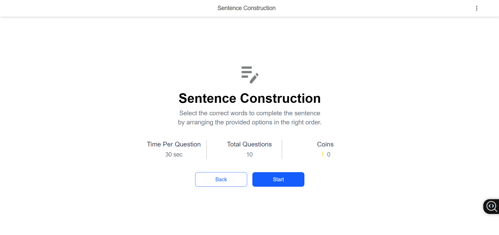

# 🧠 Sentence Construction Tool

An engaging sentence-building app built with **React**, **Vite**, and **Tailwind CSS**, designed to help users practice sentence formation through drag-and-drop mechanics. Fully powered by **localStorage** and custom logic—**no external state management** (for now!).

---

## 📁 Project Structure

```
sentence-builder/
├── public/
├── src/
│   ├── assets/
│   │   └── Pencillcon.png
│   ├── components/
│   │   ├── FeedbackScreen/
│   │   │   └── index.jsx
│   │   ├── LandingPage/
│   │   │   └── index.jsx
│   │   └── TestPage/
│   │       ├── index.jsx
│   │       └── index.css
│   ├── data/
│   │   └── questions.json
│   ├── App.jsx
│   ├── App.css
│   ├── main.jsx
│   └── index.css
├── index.html
├── package.json
├── tailwind.config.cjs
├── vite.config.js
└── README.md
```

---

## 🚀 Features

- ✨ Drag-and-drop sentence building interface
- 🕒 Timed question progression
- 🧠 Feedback screen showing:
  - ✅ Correct and incorrect responses
  - 🟢 Correct answers for each
  - 🟩 Final score with a circular progress ring
- 💾 Data persistence using localStorage
- ⚡ Built with Vite for fast development

---

## 📦 Tech Stack

- **React** — component-based UI
- **Vite** — instant dev server and lightning-fast bundling
- **Tailwind CSS** — utility-first styling
- **LocalStorage** — store user answers and progress

---

## 🧪 Setup Instructions

```bash
git clone https://github.com/YesuBalla/Sentence-Construction-Tool.git
cd sentence-construction-tool
npm install
npm run dev
```

---

## 📸 Preview



---

## 🎯 Usage

1. Start the app and land on the Landing Page.
2. Begin constructing sentences using provided word blocks.
3. Finish all questions to view the **FeedbackScreen**.
4. Review:
   - The actual correct sentence
   - Your response (marked Correct/Incorrect)
   - Your total score out of 100

---

## 🔮 Improvements Coming Soon

- Audio feedback for correct/incorrect
- Backend support for saving history
- Leaderboards and multiplayer mode
- Mobile responsiveness

---

## 🧑‍💻 Author

Built with 💡 by **Yesu Balla** — aspiring full-stack developer passionate about building intuitive edtech tools.

---

## 📄 License

MIT — free to use, remix, and improve!